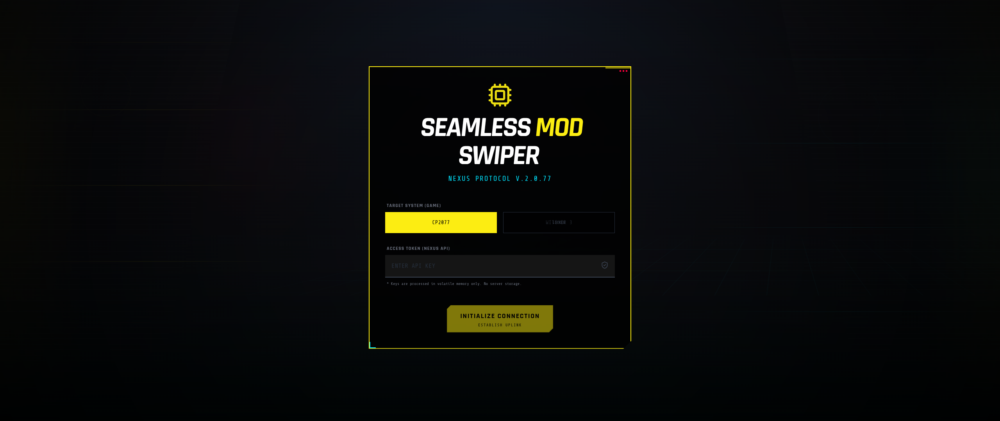

# Seamless Mod Swiper

Tinder'esque Application to Help Catalogue Your Mod List.

**The Issue:**

Nexus Mods's current UX and sorting function is pure undiluted dogshit now and they intend on keeping it that way, which makes browsing mods difficult.

**What This Application Does:**

There's a good chance you've used dating apps. This is essentially that but for mods. You see a mod, and you swipe.

* Mods you swipe **right** are "approved".
* Mods you swipe **left** are "discarded".
* Approved mods are listed on a sidebar for easy perusal, and can be exported to a text document.

The purpose of this tool is to help streamline the process of "choosing" mods. Basically get a clear idea of what you'll be working with.

**Supported Games & Data:**

* Currently supports **Cyberpunk 2077**.
* Mod "card" order is **random** every session.
* Your list of approved mods persists between sessions.

**What This Application Does NOT Do:**

* Help you install mods.
* Help you figure out mod cross-compatibility.
* Identify mod prerequisites.

By design, these tasks are left up to the user.

**Disclaimer:**

This application requires a Nexus Mods API key for functionality.

**Data & Persistence**

* The Nexus Mods API key is kept in memory only and is not persisted.
* Approved and seen mod metadata persist locally in browser storage.
* Approved mods can be exported to a text file.
* Fonts are self-hosted through local package assets to preserve the look without third-party runtime requests.
* Remote mod images are restricted to known Nexus Mods image hosts and use `no-referrer` requests.
* No telemetry.

**Contributing**

Contributions welcome. Please open issues for bugs or feature requests.
